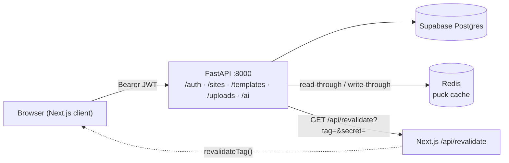
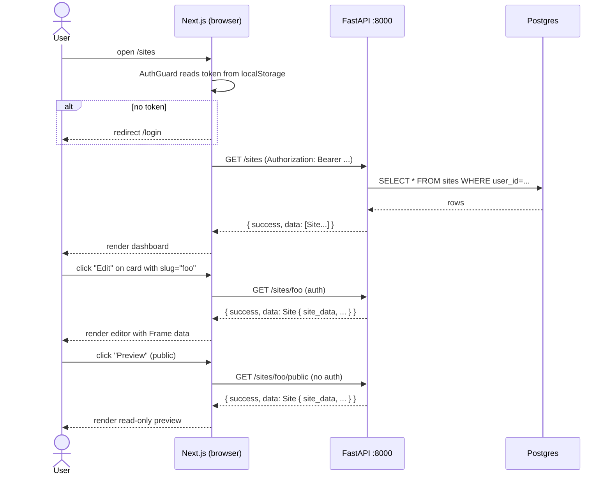
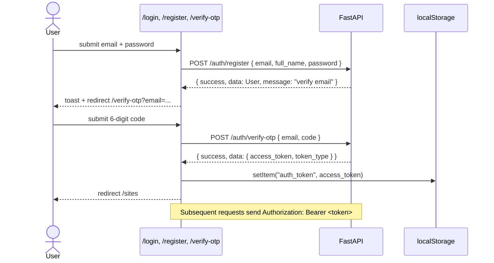
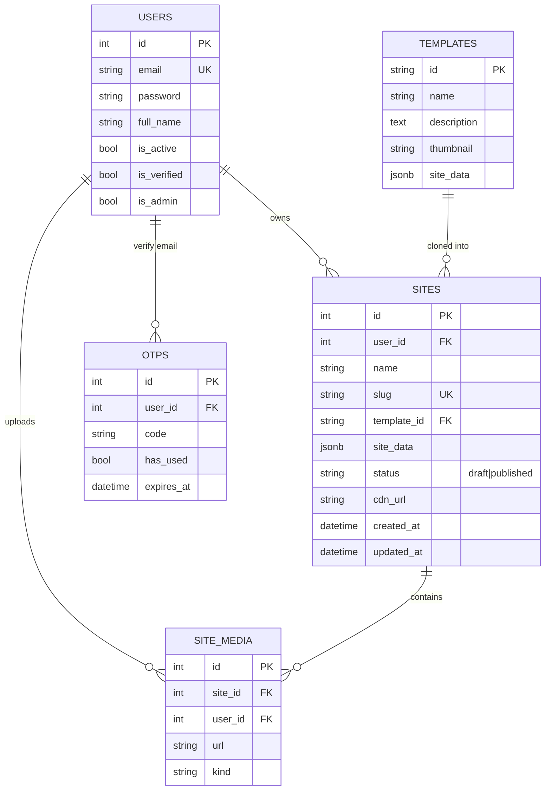

## Plan: Backend integration with auth + slug routing

Swap the localStorage-only Craft.js frontend to talk to the FastAPI backend at `http://localhost:8000`. Add an email+password+OTP auth flow, gate every page except `/login`, `/register`, `/verify-otp`, and `/preview/[slug]`, and switch the editor/preview routes from `[siteId]` to `[slug]`. Templates and sites now come from the backend. No auto-save, no localStorage migration.

**Steps**

1. **Add env config** — create `.env.local` (gitignored) with `NEXT_PUBLIC_API_BASE_URL=http://localhost:8000`. No real secrets; the backend keeps its own `.env`. (depends on —)
2. **Typed API client** — `lib/api.ts`: `request<T>(path, init)` that prepends the base URL, attaches `Authorization: Bearer <token>` from a `lib/auth.ts` token accessor, and unwraps the backend's `{ success, message, data }` envelope. Throws `ApiError` on non-2xx. Helper verbs: `apiGet`, `apiPost`, `apiPut`, `apiDelete`. (depends on 1)
3. **Auth module** — `lib/auth.ts`: token storage in `localStorage` under `auth_token` (client-only app, no cookies), `getToken()`, `setToken()`, `clearToken()`, plus `login(email,password)`, `register(email,fullName,password)`, `verifyOtp(email,code)`, `resendOtp(email)`, `getMe()`. `POST /auth/token` returns `{ access_token, token_type }` unwrapped; `POST /auth/verify-otp` returns the wrapped envelope with the token inside `data`. (depends on 2)
4. **Auth pages** — `app/login/page.tsx`, `app/register/page.tsx`, `app/verify-otp/page.tsx` (receives `?email=` via search params). All three are `use client`, use shadcn `Input`/`Button`/`Label`, show a Sonner toast on failure, and on success call `setToken()` + `router.push("/sites")`. (depends on 3)
5. **Client-side auth guard** — `components/auth/AuthGuard.tsx` (uses `useEffect` to read token, redirects to `/login` if absent, renders a loading state while checking). Wrap the dashboard, editor, and `app/page.tsx`'s redirect target. Public routes (`/login`, `/register`, `/verify-otp`, `/preview/[slug]`) are NOT wrapped. (depends on 3)
6. **Templates module** — rewrite `lib/templates.ts`: `getTemplates()` and `getTemplateById(id)` now `await` the backend (`GET /templates`, `GET /templates/{id}`). Keep the `SiteTemplate` shape (`{ id, name, description, thumbnail?, data }`) by mapping from the backend's `TemplateListResponse` / `TemplateDetailResponse`. Drop `data/templates.json` (or keep it as a fallback if you'd rather — see note in plan). (depends on 2)
7. **Sites module** — rewrite `lib/sites.ts` to use the backend. Keep the exported function signatures (`listSites`, `getSite`, `createSite`, `updateSite`, `deleteSite`) but make them async and switch the `Site` type to the backend's shape: `{ id: number, name, slug, template_id, site_data, status, cdn_url, created_at: ISO string, updated_at: ISO string }`. `createSite(name, templateId?)` becomes `POST /sites` and returns the new site (with `slug`). `updateSite(id, { data })` becomes `PUT /sites/{id}/content` with `{ site_data: data }`. Delete calls `DELETE /sites/{id}`. Remove `migrateLegacyState`, `duplicateSite`, and the localStorage helpers. (depends on 2)
8. **New-site dialog** — `app/sites/NewSiteDialog.tsx`: add a "Blank site" option as the first select entry (`value=""`, label "Blank site"). Backend's `POST /sites` accepts `template_id: null` for blank; pass through unchanged. The "Create site" button stays disabled until name is non-empty. (depends on 7)
9. **Dashboard** — `app/sites/SiteDashboard.tsx`: convert to async (`useEffect` → `setLoading`/`setSites` after `await listSites()`). Show a small "Log out" button in the header. Remove `migrateLegacyState` import. Site cards link to `/editor/{site.slug}` and `/preview/{site.slug}`. The "Open editor" header link goes to `/sites` (no longer a route to the legacy editor). (depends on 5, 7)
10. **Editor route** — rename `app/editor/[siteId]/page.tsx` → `app/editor/[slug]/page.tsx`; the page awaits `params` and passes `slug` to `SiteEditor`. (depends on —)
11. **Editor component** — `components/editor/SiteEditor.tsx`: async load via `getSite(slug)`; if 404 → toast + `router.replace("/sites")`. Remove the auto-save `setTimeout` in `onNodesChange`; the Save button in the toolbar still calls `updateSite(slug, { data })` and shows a toast. `handleLoadTemplate` calls `updateSite` after fetching the template's `site_data` from the backend. (depends on 7, 10)
12. **Editor toolbar** — `components/editor/EditorToolbar.tsx`: switch all `getSite` / `updateSite` / `deleteSite` calls to async (await + toast on failure). Header link `slug` instead of `siteId`. Templates dropdown keeps working via the async `getTemplates()`. (depends on 7, 11)
13. **Public preview route** — rename `app/preview/[siteId]/page.tsx` → `app/preview/[slug]/page.tsx`. This route stays **unauthenticated** and uses the public endpoint. Add a thin server-side loader in the page file: `await getPublicSite(slug)` → if 404, call `notFound()`. This is the only place that does SSR fetching. (depends on 7)
14. **Public preview component** — `components/preview/SitePreview.tsx`: drop the localStorage lookup; accept a fully-resolved `Site` (with `site_data`) as a prop. Strip the "Site ID" badge (the slug is meaningful to share; the integer id is not). Keep the "Copy URL" + "Edit" actions; "Edit" goes to `/editor/{slug}`. (depends on 13)
15. **Root redirect** — `app/page.tsx`: keep `redirect("/sites")`; `AuthGuard` will bounce unauthenticated users to `/login`. (depends on 5)
16. **Cleanup** — delete `data/templates.json` (or, if you want a no-network fallback, leave it and have `getTemplates` try the API first then fall back to the JSON). Delete the now-unused `lib/storage.ts`. Remove `app/editor/page.tsx` if the old `/editor` route file existed. (depends on 6, 7)

**Relevant files**

- `.env.local` — new, holds `NEXT_PUBLIC_API_BASE_URL=http://localhost:8000`
- `lib/api.ts` — new, fetch wrapper
- `lib/auth.ts` — new, token + auth functions
- `lib/sites.ts` — rewrite, async backend calls
- `lib/templates.ts` — rewrite, fetches from backend
- `lib/storage.ts` — delete
- `lib/constants.ts` — keep `SiteTemplate` type; add `Site` type matching backend response; remove `STORAGE_KEY`, `SITE_INDEX_KEY`, `SITE_PREFIX`, `SITE_COUNTER_KEY`, `siteKey`, `generateSiteId`
- `app/login/page.tsx` — new
- `app/register/page.tsx` — new
- `app/verify-otp/page.tsx` — new
- `app/sites/SiteDashboard.tsx` — async, link by slug, logout button
- `app/sites/NewSiteDialog.tsx` — add "Blank site" option
- `app/editor/[siteId]/page.tsx` — rename to `app/editor/[slug]/page.tsx`
- `app/preview/[siteId]/page.tsx` — rename to `app/preview/[slug]/page.tsx`, add server-side `getPublicSite(slug)` call
- `components/auth/AuthGuard.tsx` — new, client guard
- `components/editor/SiteEditor.tsx` — async load, drop auto-save
- `components/editor/EditorToolbar.tsx` — async save/delete
- `components/preview/SitePreview.tsx` — accept `Site` as prop, no localStorage
- `data/templates.json` — delete (or keep as fallback)
- `app/page.tsx` — no change beyond AuthGuard coverage

**Diagrams**

**Verification**

1. Start backend: `cd Portfolio-Website-Builder && uvicorn app.main:app --reload --port 8000`. Confirm `GET http://localhost:8000/` returns the health message.
2. Frontend: `npm run dev` (Next.js 16). Visit `http://localhost:3000` → expect redirect to `/login`.
3. Register a new user → land on `/verify-otp?email=...`. Check the backend's stdout/email outbox for the code, submit it, expect redirect to `/sites` and `localStorage.auth_token` populated.
4. Click "New site" → leave the template dropdown on "Blank site" → submit → expect a new card with a slug like `my-site` (or `my-site-1` on collision). Click Edit → editor loads.
5. Drag in a Container, type into a Heading, click Save in the toolbar → expect success toast. Reload the page → the heading persists.
6. Replace canvas with a backend template (Templates menu) → expect the canvas to swap and a success toast.
7. Open `/preview/{slug}` in a fresh private window (no token) → expect the preview to render. Visit `/sites` in the same window → expect redirect to `/login`.
8. Open DevTools Network → confirm every `GET/POST /sites/...` call carries `Authorization: Bearer <token>`, and a 401 (e.g. by corrupting the token in localStorage) bounces to `/login`.
9. Delete a site from the dashboard → expect it to disappear; backend's `GET /sites` no longer returns it. Confirm ISR revalidation logs in the backend stdout mention the `user:{id}` tag.
10. `npm run build` → confirm no type errors after the async conversion and the route rename.
